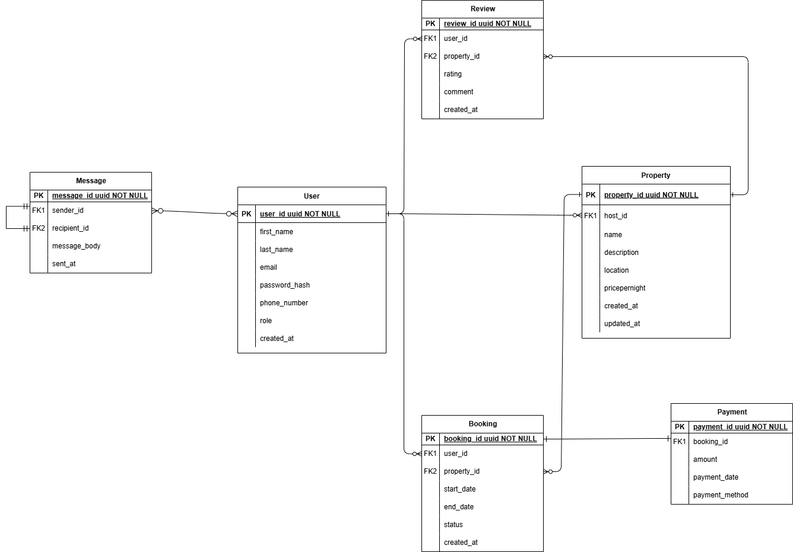

# Entity-Relationship Diagram (ERD) for Airbnb Database

## Introduction
This document provides an overview of the Entity-Relationship Diagram (ERD) for the Airbnb-like database system. The ERD represents the structure of the database, highlighting the entities, attributes, and relationships defined in the specification. This database is designed to support the core functionality of an Airbnb platform, including user management, property listings, bookings, payments, reviews, and messages.

## Entities and Attributes
The database consists of six primary entities, each representing a key aspect of the platform:

### 1. User
- **Attributes**:
  - `user_id` (Primary Key, UUID, Indexed) 
  - `first_name` (VARCHAR, NOT NULL)
  - `last_name` (VARCHAR, NOT NULL)
  - `email` (Unique, VARCHAR, NOT NULL)
  - `password_hash` (VARCHAR, NOT NULL)
  - `phone_number` (VARCHAR, NULL)
  - `role` (ENUM: guest, host, admin) NOT NULL
  - `created_at` (TIMESTAMP, DEFAULT_CURRENT_TIMESTAMP)

### 2. Property
- **Attributes**:
  - `property_id` (Primary Key, UUID, Indexed)
  - `host_id` (Foreign Key, references User)
  - `name` (VARCHAR, NOT NULL)
  - `description` (TEXT, NOT NULL)
  - `location` (VARCHAR, NOT NULL)
  - `pricepernight` (NUMERIC, NOT NULL)
  - `created_at` (Default: CURRENT_TIMESTAMP, TIMESTAMP)
  - `updated_at` (TIMESTAMP, ON UPDATE CURRENT_TIMESTAMP)

### 3. Booking
- **Attributes**:
  - `booking_id` (Primary Key, UUID, INDEXED)
  - `property_id` (Foreign Key, references Property)
  - `user_id` (Foreign Key, references User)
  - `start_date`
  - `end_date`
  - `status` (ENUM: pending, confirmed, canceled)
  - `created_at` (Default: CURRENT_TIMESTAMP)

### 4. Payment
- **Attributes**:
  - `payment_id` (Primary Key)
  - `booking_id` (Foreign Key, references Booking)
  - `amount`
  - `payment_date` (Default: CURRENT_TIMESTAMP)
  - `payment_method` (ENUM: credit_card, paypal, stripe)

### 5. Review
- **Attributes**:
  - `review_id` (Primary Key)
  - `property_id` (Foreign Key, references Property)
  - `user_id` (Foreign Key, references User)
  - `rating` (Range: 1-5)
  - `comment` (Text, not null)
  - `created_at` (Default: CURRENT_TIMESTAMP)

### 6. Message
- **Attributes**:
  - `message_id` (Primary Key)
  - `sender_id` (Foreign Key, references User)
  - `recipient_id` (Foreign Key, references User)
  - `message_body` (Text Not Null)
  - `sent_at` (Default: CURRENT_TIMESTAMP)

## Relationships
The relationships between entities are as follows:

- **User ↔ Property**: A user (host) can own multiple properties (one-to-many).
- **User ↔ Booking**: A user (guest) can make multiple bookings (one-to-many).
- **Property ↔ Booking**: A property can have multiple bookings (one-to-many).
- **Booking ↔ Payment**: A booking is associated with one payment (one-to-one).
- **User ↔ Review**: A user can leave multiple reviews (one-to-many).
- **Property ↔ Review**: A property can have multiple reviews (one-to-many).
- **User ↔ Message**: Users can exchange messages, forming a many-to-many relationship.

## ERD Diagram
Below is the visual representation of the database structure. The diagram was created using [Draw.io](https://draw.io) and includes all entities, attributes, and relationships.

## Design Considerations
- **Primary Keys**: Each entity has a unique identifier (UUID) as the primary key.
- **Foreign Keys**: Relationships between entities are maintained through foreign keys, enforcing referential integrity.
- **Constraints**:
  - Unique email addresses for users.
  - Non-null constraints on essential attributes.
  - Valid ENUM values for fields like `role`, `status`, and `payment_method`.
  - Rating values restricted to the range of 1-5 in the `Review` entity.
- **Indexes**: Frequently queried attributes, such as `email` (User), `property_id` (Property/Booking), and `booking_id` (Booking/Payment), are indexed for performance.
